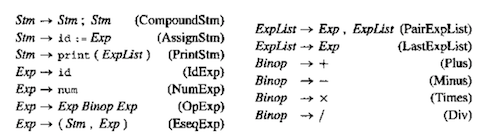
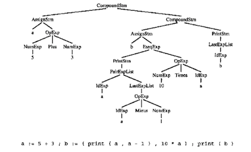

## 第一章 绪论

本章程序设计内容是为直线程序设计语言实现一个简单的程序分析器和解释器。该练习也是一次宝贵的热身机会，同学们通过练习可以对**符号表**、**抽象语法**、**树数据结构的递归性**以及无赋值语句的**函数式风格**程序设计有一个初步的认识，为后续Tiger编译器的开发打好基础。

### 1. 知识点

####1.1 直线式程序语言

既然我们要实现直线式程序语言的解释器，那么我们首先了解一下什么是直线式程序语言。作为热身练习的程序设计语言，直线式程序语言没有循环或条件控制语句，该语言的语法如下图所示



在本次的程序设计中，我们给出了一个直线式程序语言的实例`proc1.c`。文件中给出的直线式设计语言样例是一个结构化表达的抽象语法树，其结构如下图所示



#### 1.2 解释器

当计算机要执行非机器码的形式的程序，要么借助于解释器，它能直接执行源代码中的指令或抽象语法树结构，要么将它翻译为另一种能够直接执行的语言，例如翻译为汇编语言或者翻译为一种等价的高级语言。本章实践内容将会初步体验到的解释器的作用。解释器能够把高级语言一行一行直接转译运行的程序。在本章中的实践环节中，解释器分析源代码的抽象语法树，在遍历抽象语法树的同时，进行一系列相关分析。

#### 1.3 符号表

符号表是为编译器的语义分析阶段服务的一种数据结构，它的作用是将标识符映射到它们的类型和存储位置。我们为什么要记录这样的映射关系呢？因为我们需要判断，当我们在程序中使用某个标识符的时候，它是否可以在此时此地被正确使用。这时，符号表就发挥了作用，当定义某个变量或者函数的时候，我们将该变量或函数的名字、类型记录在符号表中，以便在使用该标识符的时候检查。在本章的实践中，我们并不需要如此复杂的符号表，我们仅仅是感受一下它的存在，只是记录变量名和对应数值即可。

#### 1.4 抽象语法

抽象语法是对源代码的一种抽象，进行这样的抽象的意义在于，便于形式化地分析，同时去除掉源程序中对语义没有意义的部分。在本章中，抽象语法的定义在`slp.h`和`slp.c`中描述，在`proc1.h`和`proc1.c`中被使用。

```c
A_stm prog(void) {

  return A_CompoundStm(
      A_AssignStm("a", A_OpExp(A_NumExp(5), A_plus, A_NumExp(3))),
      A_CompoundStm(
          A_AssignStm("b",
                      A_EseqExp(A_PrintStm(A_PairExpList(
                                    A_IdExp("a"),
                                    A_LastExpList(A_OpExp(A_IdExp("a"), A_minus,
                                                          A_NumExp(1))))),
                                A_OpExp(A_NumExp(10), A_times, A_IdExp("a")))),
          A_PrintStm(A_LastExpList(A_IdExp("b")))));
}
```


上述`proc1.c`中描述的就是上述直线式程序的抽象语法树。在本章中，抽象语法树是手动构造的，在之后的章节中，你会学习自动化构造抽象语法树的方式。

#### 1.5 树数据结构

编译器中使用的许多重要数据结构都是源语言的中间表示。这些中间表示经常采用树的形式，树的节点有若干种类型，每一种类型都有一些不同的属性。例如，抽象语法树的树节点描述的是抽象语法的相关信息，中间代码表示树节点描述的是中间表示的相关信息。在本章中，你会尝试着遍历`proc1.c`中提供的抽象语法树，从而进行一系列的分析。在之后的诸多章节中，遍历一个树数据结构将会是最常见的操作。

#### 1.6 函数式语言

用函数式语言编写的程序中，所有的成分都是函数的一部分，整个程序就是一系列的嵌套函数，并且在函数中可以定义函数。

### 2. 程序设计要求

####（1）写一个函数`int maxargs(A_stm)`，告知给定语句中任意子表达式内的print语句的参数个数

值得注意的是，`print`语句中可能含有表达式，而这些表达式中也可能还含有其他的`print`语句，即`print`语句的嵌套。

#### （2）写一个函数`void interp(A_stm)`，对一个用直线式程序进行解析。

其中，解析任务就是在分析完整个程序之后，打印出该段直线式程序设计语言的符号表内容。在实现过程中，构造两个互相递归的函数`interpStm`和`interpExp`。将一个标识符映射到赋给此标识符的整数值的“表”。

```C
typedef struct M_table_ *M_table;
struct M_table_ {
  string id;
  int value;
  M_table tail;
};
M_table M_Table(string id, int value, M_table tail) {
  M_table t = checked_malloc(sizeof(*t));
  t->id = id;
  t->value = value;
  t->tail = tail;
  return t;
}
```

于是，语句的解释由`interpStm`完成，输入语句抽象语法树节点和符号表，生成一个新的表：`M_table interpStm(A_stm s, M_table t)`

表达式的解释要比语句的解释复杂一些，因为表达式返回整型值。为此，我们需要一张新的表

```C
typedef struct M_intAndTable_ *M_intAndTable;
struct M_intAndTable_ {
  int i;
  M_table t;
};
M_intAndTable M_IntAndTable(int i, M_table t) {
  M_intAndTable it = checked_malloc(sizeof(*it));
  it->i = i;
  it->t = t;
  return it;
}
```

表达式的解释由`interpExp`完成，输入一个表达式抽象语法树节点和符号表，生成一个带有整型值的符号表：`M_intAndTable interpExp(A_exp e, M_table t)`

最后，在遍历完抽象语法树之后，将符号表中的内容一次打印出即可。

